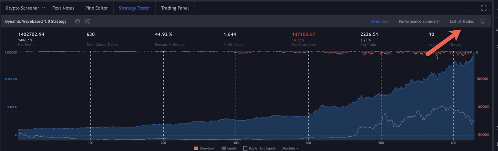
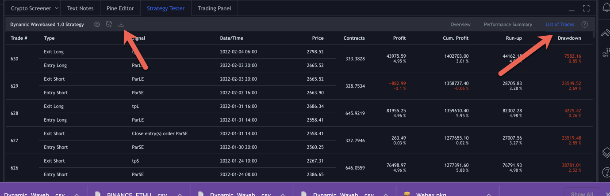
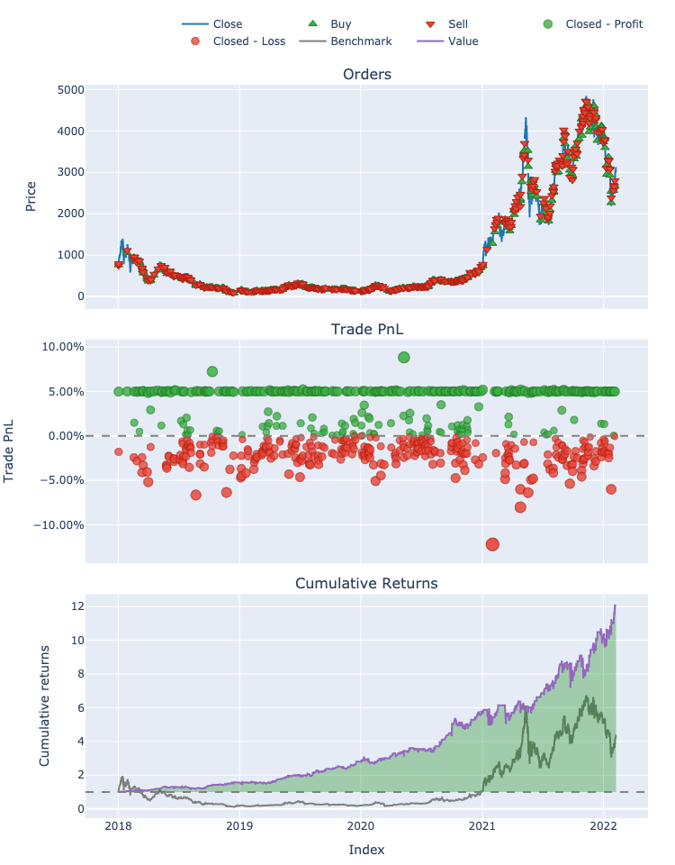

# Converting Tradingview Trade Files to VectorBT strategies

Run a backtested strategy in pinescript in tradingview. Then download the trades from tradingview into a csv.

Drop that csv into the `data` folder and import the trades into a vectorbt backtested portfolio. Note, you will also need to download data of the actual series you are running. eg. In this case I am using `ETHUSDT` 2 hour data from Binance and my start date is 2018-01-01.

Once you run the trades through into a strategy and portfolio, you can see the following preview of the output.

